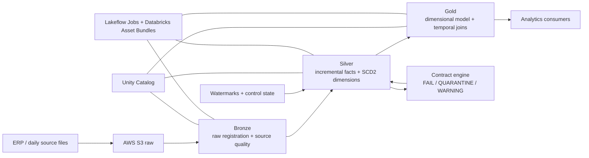

# Varejinho Data Platform

A retail data platform reconstruction built on Databricks, PySpark, Delta Lake, Unity Catalog, AWS S3, Lakeflow Jobs and dbt.

This repository documents the migration of a legacy data warehouse workflow into a governed, incremental and testable lakehouse-style platform. The focus is not only on moving data through Bronze, Silver and Gold, but on proving that each layer behaves correctly under mutable daily files, historical dimensions, temporal joins, data contracts and environment isolation.

> **Current status:** the core Silver incremental architecture, SCD2 dimensions, Gold temporal joins, Data Contracts, Schema Drift and dbt validation/documentation layer are validated in `dev`. **The Release Gate is now the active block.**

---

## Why this project exists

The reconstruction started from a working retail analytics environment, but the engineering guarantees around it were incomplete. The hardening effort turns implicit behavior into explicit platform rules:

- separate `dev` and `prod` execution paths;
- process only mature daily partitions instead of assuming a folder is complete because it exists;
- maintain state with watermarks and controlled `APPLY -> VALIDATE -> COMMIT` transitions;
- preserve historical dimension versions with SCD Type 2;
- resolve fact-to-dimension relationships using the business event date, not only the current dimension row;
- make YAML data contracts executable instead of leaving validation logic duplicated inside notebooks;
- fail closed on structural problems, quarantine recoverable bad rows, and keep warnings non-blocking;
- prove changes with fixtures and quality gates before promoting them into the daily DAG.

A guiding rule throughout the reconstruction is:

> **Measure first. Prove the failure mode. Change second.**

---

## Architecture



### Environment model

- `varejinho_dev` is the isolated hardening catalog.
- `varejinho` is the production catalog.
- Bronze raw data is shared read-only where appropriate, while Silver/Gold writes remain isolated by target.
- Production schedules remain paused during hardening and are only eligible for promotion after the Release Gate.

---

## Medallion layers

### Bronze

Bronze keeps source data close to its raw shape and exposes the file metadata required by downstream maturity rules.

The key lesson from the retail ingestion pattern is that a date-partitioned folder can exist while the source is still writing files into it. For the incremental fact pipeline, a partition is considered mature only after the file modification evidence shows that the partition is no longer open.

Conceptually:

```text
partition D is mature when its files were last modified after D
```

This prevents rows from an open daily partition from being promoted into Silver too early.

### Silver

Silver contains two different state models.

**Current-state transactional facts** use an incremental D+1 process with a shared watermark pattern:

```text
APPLY -> VALIDATE -> COMMIT
```

The daily pipeline currently handles `venda` plus 13 additional transactional/financial facts. A successful commit requires the mature candidate to pass validation before the watermark advances.

The implementation preserves:

- inserts;
- updates;
- no-delete semantics when a key is absent from a later snapshot;
- row-level quarantine;
- replay/idempotency;
- open-partition blocking;
- post-commit mutation detection for already accepted daily partitions.

Each committed fact partition now has an auditable physical manifest derived from the source file set (`_metadata.file_path` + `_metadata.file_modification_time`). The runtime verifies committed history before APPLY, stages the candidate fingerprint after VALIDATE, rechecks it before COMMIT, and only then advances the watermark. A later mutation of an already committed partition therefore fails closed instead of silently escaping the forward-only watermark.

**Historical dimensions** use real SCD Type 2 behavior for:

- `produto`;
- `fornecedor`;
- `mercadologico`.

Where reliable business timestamps exist, they are used to define temporal boundaries. Where the source cannot provide historical change timestamps, the platform falls back to the first observed ingestion snapshot instead of inventing history.

### Gold

Gold materializes the analytical dimensional model: 5 dimensions and 9 fact tables.

A critical hardening step was replacing current-row joins with temporal joins where a fact must resolve the dimension version that was valid when the business event happened.

The temporal predicate is:

```sql
event_ts >= valid_from
AND (valid_to IS NULL OR event_ts < valid_to)
```

Examples now validated in the platform:

- purchases -> product by `datacompra`;
- purchases -> supplier by `datacompra`;
- promotions -> product by `datainicio`;
- accounts payable -> supplier by `dataemissao`;
- other expenses -> supplier by `dataemissao`.

If an event predates the first modeled dimension boundary, the fact is preserved with a null surrogate key. The pipeline does **not** silently fall back to the current or earliest-known dimension version.

---

## Data Contracts

Data Contracts were rebuilt from static YAML documentation into an executable Silver control layer.

The contract policy classifies all 37 Silver entities into three tiers:

| Tier | Entities | Policy |
|---|---:|---|
| `critical` | 9 | Full executable contract |
| `high` | 11 | Core executable contract |
| `standard` | 17 | Simplified structural availability gate |

The 20 `critical/high` contracts are environment-independent and use logical references such as `produto.id` instead of hardcoded catalog paths.

The central engine validates:

- required columns;
- exact Spark types;
- nullability;
- grain / uniqueness;
- min / max / accepted values;
- referential integrity;
- freshness;
- severity.

### Contract actions

| Condition | Action |
|---|---|
| Missing contract, missing column, invalid YAML, incompatible type | **FAIL CLOSED** |
| Recoverable row-level `error` | **QUARANTINE** |
| `warning` rule | **LOG / CONTINUE** |

For snapshot-based facts, uniqueness is scoped by `ingestion_date`: the same business key may legitimately appear in different snapshots, but duplicate occurrences inside the same snapshot are rejected.

The same central contract runtime is used by both `APPLY` and pre-commit `VALIDATE`, avoiding two competing interpretations of the YAML.

---

## Schema Drift

Schema Drift is enforced through one canonical control plane:

- `quality/schema_drift_engine.py` owns comparison, classification, event persistence and explicit promotion;
- `quality/schema_drift_runtime.py` is the Silver runtime adapter;
- runtime never bootstraps a missing baseline automatically;
- additive drift is logged but projected back to the accepted baseline until explicit promotion;
- removed columns, type changes and mixed breaking drift persist an event and **BLOCK** the run;
- baseline promotion is a separate, auditable operation.

Coverage is complete across all 37 Silver entities:

- 14 incremental facts;
- 19 reference dimensions;
- `curvaabc`;
- 3 SCD2 dimensions.

Reference dimensions use a full preflight before any write, avoiding partial Silver updates. SCD2 drift is evaluated on the **Silver-shaped output interface**, so upstream Bronze columns that are intentionally not materialized do not create false additive drift.

Validation evidence:

- isolated Schema Drift fixture: `6/6`;
- fact regressions: D4 `9/9` and D7C `11/11`;
- reference/snapshot preflight: `20/20` with `no_drift / ALLOW`;
- SCD2: product, supplier and merchandising all `no_drift / ALLOW`;
- final read-only registry audit: `37/37` baselines exact vs committed Silver, `37/37` physical column order aligned, `0` invalid baselines and `0` actionable findings;
- final daily E2E after the D+1 mutation guard: Silver QG `99/99`, Gold QG `52/52`.

---

## Validation evidence

The project is built around explicit gates rather than "it ran without an exception".

### Latest end-to-end dev run

- **Silver Quality Gate:** `99/99` checks passed, including 14 committed-partition mutation checks.
- **Gold Quality Gate:** `52/52` checks passed, including exact eligible-grain reconciliation for supplier payables.
- **dbt Gold validation:** `46` data tests across `14` Gold sources -> **44 PASS / 2 WARN / 0 ERROR / 0 SKIP**; warnings are intentional business-anomaly monitors.
- **D+1 mutation guard:** explicit manifests bootstrapped and verified for all `14/14` incremental facts; isolated fixture `7/7`; D4 `9/9`; D7C `11/11`.
- **Accounts payable reconciliation:** `840` Silver installments reference `653` headers absent from Bronze; the eligible Silver fact grain reconciles exactly to Gold with `0` missing and `0` extra rows.
- All 14 incremental facts committed through the latest mature partition in that run.
- All 20 executable contracts were structurally compatible with the materialized Silver schema.
- All 17 standard entities passed the simplified availability gate.
- Gold temporal joins remained consistent after the Silver/Data Contracts/Schema Drift changes.
- **Schema Drift final registry audit:** `37/37` baselines found, `37/37` exact vs Silver, `37/37` physical column order aligned, `0` invalid baselines and `0` actionable findings.

Latest validated dev volumes include:

| Gold fact | Rows |
|---|---:|
| Sales | 4,380,703 |
| Stock movements | 22,012,923 |
| Purchases | 246,349 |
| Promotions | 336,395 |
| Losses | 84,225 |
| Offers | 78,103 |
| Accounts payable | 75,913 |
| Other expenses | 19,457 |
| ABC curve snapshots | 290,344 |

These numbers are validation evidence from the current dev state, not fixed business totals.

---

## Hardening journey

The repository intentionally keeps the evolution visible. The current architecture was reached through a sequence of measured gates rather than a rewrite in one step.

| Stage | Result |
|---|---|
| Environment isolation | `dev` and `prod` targets separated; dev writes isolated |
| Bronze registration and source checks | Raw layer registered and usable by downstream gates |
| Silver reference layer | Reference entities materialized for downstream joins |
| Product SCD2 | Real Type 1 / Type 2 behavior, incremental updates and replay proven |
| Supplier SCD2 | Business semantics profiled, incremental engine and replay proven |
| Merchandising SCD2 | First-observed temporal history implemented where source timestamps do not exist |
| Incremental facts | `venda + 13` facts moved to mature-partition processing with watermark control |
| D+1 maturity | Open partitions blocked using file metadata evidence |
| Post-commit mutation guard | Physical manifests for `14/14` facts; validate/commit recheck; E2E Silver QG `99/99` |
| Gold temporal model | Historical facts resolve the dimension version valid at the event date |
| Data Contracts | Central engine, canonical YAMLs, fixtures, runtime integration and E2E validation |
| Schema Drift | Canonical engine/runtime across all `37/37` Silver entities; explicit promotion; final registry audit passed |
| dbt cleanup / ownership | External Gold sources, native Databricks dbt task and read-only tests/docs validated in dev |
| Release Gate | Final diff review, prod-safe deployment and controlled smoke test |

---

## Current roadmap

### 1. Release Gate — active

Core hardening through dbt and the D+1 post-commit mutation guard is closed. The active Release Gate sub-block is the SCD2 reappearance policy, followed by:

- review the full `feature/platform-hardening` -> `main` diff;
- remove or archive temporary hardening artifacts that should not ship;
- validate dev and prod bundle targets;
- keep prod schedules paused on first deployment;
- merge through PR;
- deploy prod manually;
- run controlled Silver/Gold smoke tests;
- unpause schedules only after validation.

Later work includes ERP-to-Gold reconciliation, deeper observability/SLOs, governance evidence, performance benchmarking and downstream BI integration.

---

## Orchestration

The Databricks Asset Bundle is the canonical deployment definition.

The daily DAG follows the same safety ordering used throughout the project:

```text
Bronze Quality
    -> SCD2 APPLY / VALIDATE / COMMIT
    -> incremental facts APPLY / VALIDATE / COMMIT
    -> Silver Quality Gate
    -> Gold dimensions
    -> Gold facts
    -> Gold Quality Gate
```

The quality gates are blocking dependencies: Gold is not rebuilt when Silver fails validation.

---

## Repository structure

```text
.
├── contracts/          # Silver YAML contracts and contract fixtures
├── dbt/                # read-only Gold tests/documentation/lineage layer
├── docs/               # project documentation / decision records
├── pipeline/
│   ├── bootstrap/      # environment bootstrap and isolation validation
│   ├── bronze/         # raw registration and Bronze quality
│   ├── silver/         # SCD2, incremental facts, fixtures and Silver QG
│   ├── gold/           # dimensions, facts, temporal profiling and Gold QG
│   └── databricks.yml  # Databricks Asset Bundle / Lakeflow Jobs definition
└── quality/            # canonical Data Contracts + Schema Drift engines/runtime adapters
```

---

## Running the dev target

Prerequisites:

- Databricks CLI authenticated to the target workspace;
- access to the configured Unity Catalog and source storage;
- permissions required by the bundle resources.

From the repository:

```bash
cd pipeline

databricks bundle validate --target dev
databricks bundle deploy --target dev
databricks bundle run pipeline_diario --target dev
```

During hardening, use `--target dev` explicitly. Production schedules are intentionally kept paused until the Release Gate.

---

## Engineering principles behind the project

This reconstruction is intentionally opinionated about data reliability:

1. **A successful notebook is not the same as correct data.**
2. **Folder existence is not proof that a daily partition is complete.**
3. **A watermark only advances after validation.**
4. **Historical facts should not silently inherit today's dimension attributes.**
5. **A contract should be executable, not decorative YAML.**
6. **Drift detection and schema approval are different decisions.**
7. **Replay and fixtures are part of the architecture, not cleanup tools.**
8. **Production promotion is a gate, not the next command after dev succeeds.**

---

## Project status

This repository is an active reconstruction/hardening project. The core incremental Silver path, SCD2 modeling, Gold temporal semantics, Data Contracts, Schema Drift and dbt validation/documentation layer have been validated in the dev environment. The final Release Gate is now the active block.

Built as a hands-on Data Engineering project around real retail pipeline constraints.