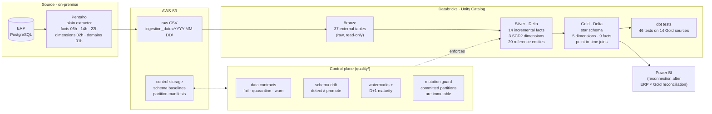
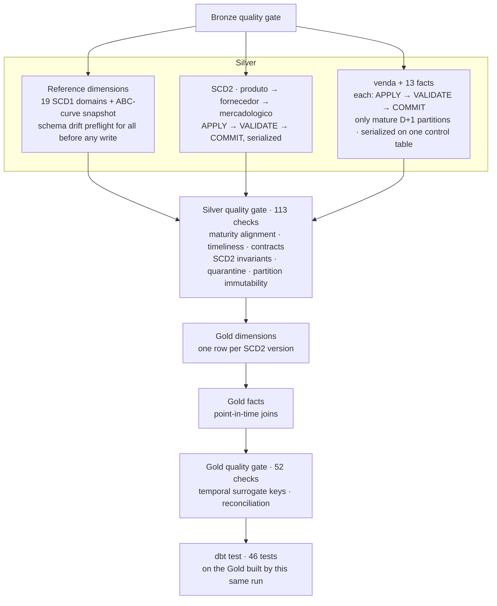

# Varejinho Data Platform

**A retail lakehouse rebuilt on Databricks with production-grade guarantees:** incremental Silver processing that never reads an unfinished day, real SCD Type 2 history, point-in-time Gold facts, executable data contracts, controlled schema evolution and a release process where every claim is backed by a reproducible test.

> **TL;DR**
> I built the first data platform of a Brazilian supermarket group (two stores and a distribution center) as its only data professional: ERP → Pentaho → CSV on S3 → Athena → Power BI. Operating it showed me where it broke: records lost at month boundaries, full reprocessing on every load, no history for master data and no quality gates. This repository is the rebuild. The hardest problem turned out to be time: knowing when a day of source data is actually complete, and making facts join the version of a product or supplier that was true *on the day the event happened*.

**Status:** release candidate. Fully validated in the `dev` target (final run `707938728538043`: Silver QG 113/113, Gold QG 52/52, dbt 44 pass / 2 intentional warnings / 0 errors). Production cutover follows the merge to `main`.

**Stack:** Databricks (Unity Catalog, Delta Lake, serverless Lakeflow Jobs, Declarative Automation Bundles) · PySpark · Spark SQL · dbt · AWS S3 · Pentaho Data Integration · PostgreSQL (source ERP)

---

## Contents

1. [Where this started](#where-this-started)
2. [Architecture](#architecture)
3. [How a daily run flows](#how-a-daily-run-flows)
4. [Guarantees and how each one is proven](#guarantees-and-how-each-one-is-proven)
5. [What I found along the way](#what-i-found-along-the-way)
6. [Gold model](#gold-model)
7. [Evidence and measurements](#evidence-and-measurements)
8. [Repository map](#repository-map)
9. [Running it](#running-it)
10. [Governance and scope](#governance-and-scope)
11. [Known limitations and roadmap](#known-limitations-and-roadmap)

---

## Where this started

The first version worked and delivered dashboards, but it had no engineering guarantees. Running it day to day, I identified the failure modes that shaped this rebuild:

| Legacy behavior | Consequence | Replaced by |
|---|---|---|
| Extraction filtered by `date_trunc('month', CURRENT_DATE)` | Records from the last day of the month could be lost when the month turned; backfills were manual | Raw data partitioned by `ingestion_date`; Silver advances by watermark |
| Every load re-read and rewrote the whole month | Wasted compute; no notion of what was already processed | Incremental `APPLY → VALIDATE → COMMIT` per entity |
| Columns and joins chosen inside the ETL tool | Every new analysis meant changing extraction | Pentaho reduced to a plain extractor (`SELECT *`, no joins, no renames) |
| CSV as the analytical format | Every query scanned everything | Delta Lake with partitioning in Silver/Gold |
| Master data overwritten in place | No way to know what a product or supplier looked like in the past | SCD Type 2 with evidence-based validity dates |
| No contracts or gates | Errors propagated straight to dashboards | Contracts, schema drift control, quality gates at every layer, dbt tests |

---

## Architecture



**Layer responsibilities.** Bronze preserves the raw source exactly and exposes file metadata. Silver turns it into a trustworthy interface: types, grain, deduplication, contracts, quarantine and history. Gold serves analytics: a star schema whose facts carry the dimension version valid at the business date of each event.

**Environments.** `dev` and `prod` are separate Unity Catalog catalogs deployed from the same bundle. Dev reads the shared raw Bronze through read-only views (Unity Catalog does not allow two external tables on the same path) and writes only its own Silver, Gold and control state. Production jobs run as a service principal.

---

## How a daily run flows

One run per day at 03:00 (America/Fortaleza), after the source has closed the previous day. Every stage is a blocking dependency: nothing downstream runs on top of a failed check.



The watermark of an entity only moves in its `COMMIT` task, which only runs if `VALIDATE` passed. A failure in one fact leaves every other committed entity untouched and is retried surgically.

---

## Guarantees and how each one is proven

Each guarantee has a mechanism in the runtime and an isolated fixture that proves it. Fixtures run the real runtime notebooks against synthetic or sandboxed data, so the proof covers the code that ships.

| Guarantee | Mechanism | Proven by |
|---|---|---|
| Never read a day that is still being written | D+1 maturity from physical file metadata: day `D` is processed only when its files were last modified after `D` | D6A (open partition stays out), D7C 11/11 |
| A watermark only moves after validation | `APPLY → VALIDATE → COMMIT` as separate DAG tasks | D4 9/9 (update, insert, no-delete, quarantine, watermark) |
| Already-committed history cannot change silently | Per-partition manifest fingerprinting `_metadata.file_path` + modification time, checked at apply, commit and in the Silver gate | R2 7/7 |
| Master-data history is real and replay-safe | One incremental SCD2 engine; Type 1 vs Type 2 decided per attribute from profiled real changes | B7E 17/17, replay idempotency, generic-engine regression vs. full backfill, R3 11/11 |
| Facts use the version valid when the event happened | Point-in-time joins on each fact's business date | Gold QG: stored surrogate key = expected temporal key for every audited relation |
| The Silver interface is enforced, not documented | One contract engine: structural breaks fail closed, bad rows go to quarantine, warnings never block | C3 7/7 |
| A schema change is a decision, not a side effect | Drift is detected and classified; baselines change only through explicit promotion | S2 6/6, 37/37 baselines audited exact vs. Silver |
| The pipeline cannot stall silently | Timeliness check: committed watermark at most 2 days behind the business date | Silver QG (14 checks) |
| Gold is correct and consistent | Gold quality gate + dbt source tests | Gold QG 52/52, dbt 44 pass / 2 warn / 0 error |

The two dbt warnings are intentional business monitors (offer anomalies), not technical failures.

---

## What I found along the way

The most valuable part of this project was not the code, but what measuring the source revealed. Three examples:

### 1. A daily folder is not a finished day

The first incremental run for purchase-invoice items disagreed with a full rebuild: 502 keys in Silver no longer existed anywhere in the raw layer, and one key had appeared inside a day already processed, while every shared key matched value for value. The transformation was not the problem; the input was moving. Reading `_metadata.file_modification_time` showed that the extractor rewrites the current day's file several times until the next day, and profiling all fact tables showed no file ever modified after D+1.

That became the **D+1 maturity rule**, a narrow repair of only the contaminated partitions (instead of a blind full rebuild) and, later, a **mutation guard** that blocks the pipeline if an already-committed partition ever changes.

### 2. A table that looked like SCD2 but kept no history

The original dimensions had `valid_from`, `valid_to` and `is_current`, but each load dropped the table and rebuilt it from the latest snapshot. It looked like history and preserved none. The rebuild started from evidence: profiling which product attributes really change (for example, full descriptions and category) before deciding what deserves a new version. For suppliers, only identity-bearing attributes (tax ID and legal name) create versions; the operational attributes that actually changed are Type 1, and sensitive supplier fields were excluded from Silver entirely. The incremental engine is proven equal to an independent full backfill.

### 3. A rule that worked by timezone coincidence

The maturity rule compares dates in UTC. It holds today because the extractor's last daily load runs at 22:00 local time, which is 01:00 UTC of the next day (verified across five consecutive days). If that load ever moved earlier, no partition would ever mature, the watermark and the maturity boundary would stall together, and every existing check would stay green while nothing was processed. The fix was not to touch a proven rule before release, but to add the missing **timeliness** dimension to the Silver gate and to record the coupling. The long-term fix, a `_SUCCESS` marker written by the extractor, is planned together with moving extraction to one daily load.

---

## Gold model

Star schema built by PySpark/Spark SQL; dbt tests and documents it as external sources.

**Dimensions:** `dim_produto`, `dim_fornecedor`, `dim_mercadologico` (one row per SCD2 version, surrogate key = hash of id + `valid_from`), `dim_loja`, `dim_tempo` (one row per day).

| Fact | Grain | Point-in-time join | Partitioning |
|---|---|---|---|
| `fato_vendas` | one row per item sold per transaction | product by `data` | `ano`, `mes` |
| `fato_compras` | one row per purchase-order item | product and supplier by `datacompra` | `ano`, `mes` |
| `fato_perdas` | one row per loss record | product by `data` | `ano`, `mes` |
| `fato_movimento_estoque` | one row per stock movement | product by `datamovimento` | `ano`, `mes` |
| `fato_promocoes` | one row per product in a promotion | product by `datainicio` | `ano`, `mes` |
| `fato_oferta` | one row per product on offer per store | product by `datainicio` | `ano`, `mes` |
| `fato_contas_pagar` | one row per supplier-payment installment | supplier by `dataemissao` | `ano`, `mes` |
| `fato_outras_despesas` | one row per operating expense | supplier by `dataemissao` | `ano`, `mes` |
| `fato_curva_abc` | one row per product, store and snapshot date | product by `snapshot_date` | `snapshot_date` |

Events dated before the first known version of a dimension keep a null surrogate key instead of silently falling back to the current version: joining on `is_current` would quietly rewrite the past.

---

## Evidence and measurements

### Final validation run (dev, 2026-09-23)

| Check | Result |
|---|---|
| `pipeline_diario` run `707938728538043` | SUCCESS · 58 tasks |
| Silver quality gate | 113 / 113 |
| Gold quality gate | 52 / 52 |
| dbt | 44 pass · 2 warn (intentional) · 0 error · 46 tests |
| Regression fixtures | D4 9/9 · D7C 11/11 · R2 7/7 · R3 11/11 |

### Data scanned per question

The legacy baseline was measured on Athena over the CSV extracts. The same raw CSV is also read by Databricks as Bronze, so the Bronze and Gold columns compare **formats on the same engine**. Bytes scanned is the metric that matters here: it is what Athena bills and what drives latency as data grows.

| Question | Legacy: CSV on Athena | Bronze CSV on Databricks | Gold Delta on Databricks |
|---|---|---|---|
| Sales by store for one month | 269.59 MB (full scan) | full scan | **496 KB** (partition pruning, over 500× less) |
| Count all sales | 269.59 MB (full scan) | 588 MB (full scan) | **0 B** (answered from Delta log statistics) |
| Sales of one product | 269.59 MB (full scan) | full scan | 33 MB (no effective file skipping, see limitations) |

Absolute CSV sizes differ because Bronze has accumulated more daily partitions since the legacy baseline; the structural point is that CSV reads everything for every question.

### Where the run time goes

Two runs were profiled task by task (about 40 minutes each). Typical tasks take 5 to 30 seconds; a few tasks per run wait about 300 or 600 seconds regardless of data volume (the same watermark commit took 5 s in one run and 606 s in the other), and different tasks stall in each run. Roughly 25 minutes of the critical path is serverless platform wait on Databricks Free Edition, not processing. Optimization was therefore deferred until it can be measured against that noise: measure first, then change.

---

## Repository map

```text
pipeline/        What production runs
├── databricks.yml     bundle identity, variables, targets, sync
├── resources/         production jobs (pipeline_diario, manutencao_semanal, dbt_tests)
│   └── dev/           ops and validation jobs, declared only under targets.dev
├── bronze/  silver/  gold/     runtime notebooks and Gold SQL
quality/         Control plane: contract engine, schema drift engine, partition manifests
contracts/       Silver data contracts (YAML) and tier policy
dbt/             Read-only tests and documentation over Gold sources
ops/             One-off, dev-guarded operations: bootstrap, SCD2 backfill (DR path), seeding, repairs, grants
validation/      The evidence: fixtures, replays, profilers and diagnostics, grouped by block
docs/            Decision log and architecture notes
```

Naming convention inside `validation/`: `profile_` and `diagnose_` only read; `prepare_` builds a sandbox; `verify_` checks the result and cleans up; `fixture_` does all three.

- [Decision log](docs/decision_log.md): every architectural and operational decision with its reasoning and consequences
- [Daily partition maturity](docs/architecture/daily_partition_maturity.md)
- [dbt layer](dbt/README.md)
- [Production service principal grants](ops/bootstrap/grant_prod_service_principal.sql)

---

## Running it

The platform depends on a private source, so it is not reproducible end to end outside the company. The deployment itself is standard:

```bash
cd pipeline

# values kept out of Git
# .databricks/bundle/<target>/variable-overrides.json  ->  {"alert_email": "..."}

databricks bundle validate -t dev
databricks bundle deploy   -t dev
databricks bundle run pipeline_diario -t dev

# any proof, for example the incremental facts fixture
databricks bundle run facts_incremental_fixture -t dev
```

Runtime notebooks have no environment defaults: `catalog`, `bundle_files_path`, `control_root` and `bronze_source_catalog` come only from the target, and a missing value fails the task immediately.

---

## Governance and scope

- **Production** is the release environment of this project on Databricks Free Edition. The company's operational reporting does not depend on it, and using real company data in this environment is subject to the company's authorization. Moving to a paid workspace is a change of `workspace.host` in the target.
- **Least privilege.** Production jobs run as a service principal with versioned Unity Catalog grants: read-only Bronze; read, write and create on Silver, Gold and control; no admin rights. Bundle files live in a restricted folder, because whoever can edit the code a service principal runs effectively holds its privileges.
- **Data minimization.** Supplier fields such as credentials, personal documents and phone numbers are excluded from Silver by an explicit allowlist.
- **This repository contains code only.** No business data is committed; fixtures use synthetic identifiers. Code is published for portfolio review; all rights reserved.

---

## Known limitations and roadmap

Stated plainly, because a platform is only as trustworthy as its documented edges.

- **Gold freshness is D-1 by design.** The source ERP is itself D+1; complete days are preferred over an incomplete current day.
- **D+1 maturity depends on the extractor schedule and UTC.** Detected by the timeliness gate; to be replaced by a `_SUCCESS` completion marker when extraction moves to one daily load.
- **Z-Order does not survive the daily Gold rebuild.** Gold facts are recreated with `CREATE OR REPLACE` and Z-Order is applied weekly, so file skipping on product filters is lost the next day. Next step: liquid clustering declared in the table DDL, benchmarked against the current layout.
- **Serverless wait dominates run time** on Free Edition (see measurements).
- **Source orphans.** Some supplier-payment installments reference headers absent from the source extract; they are reported by the Gold gate as a source limitation instead of being dropped silently or fabricated.
- **Bronze quality gate covers the 10 critical fact tables**, not all 37 raw tables.
- **No CI or unit tests yet.** Correctness is proven by in-workspace fixtures. `pyproject.toml` is prepared for a GitHub Actions pipeline with bundle validation, linting and PySpark unit tests over `quality/`.
- **Accuracy against the ERP is the next proof.** Quality gates prove internal consistency; an independent ERP × Gold reconciliation comes before reconnecting Power BI.

---

Built by **Zara Louise**, the data analyst who designed, operated and rebuilt this platform end to end · [LinkedIn](https://www.linkedin.com/in/zaralouiseluz/)
